<p align="center">
  
</p>

<h1 align="center">AgentGate</h1>

<p align="center">
  <b>Take back model choice for your AI agents.</b><br>
  Official client requests enter a local control point first: protocol conversion, native pass-through, provider routing, failover, cost tracking, and request tracing.
</p>

<p align="center">
  <a href="https://github.com/dengmengmian/agentgate-ai/releases"></a>
  <a href="https://github.com/dengmengmian/agentgate-ai/stargazers"></a>
  <a href="https://github.com/dengmengmian/agentgate-ai/releases"></a>
  <a href="../LICENSE"></a>
</p>

<p align="center">
  <a href="./full-reference-zh.md">中文版</a> · <a href="../README_ZH.md">中文 README</a> · <a href="https://github.com/dengmengmian/agentgate-ai/releases">Download</a> · <a href="#5-minute-quick-start">5-Minute Quick Start</a> · <a href="./use-codex-with-deepseek.md">Codex + DeepSeek</a> · <a href="./use-claude-code-with-deepseek.md">Claude Code + DeepSeek</a> · <a href="./use-gemini-cli-with-agentgate.md">Gemini CLI</a>
</p>

<p align="center">
  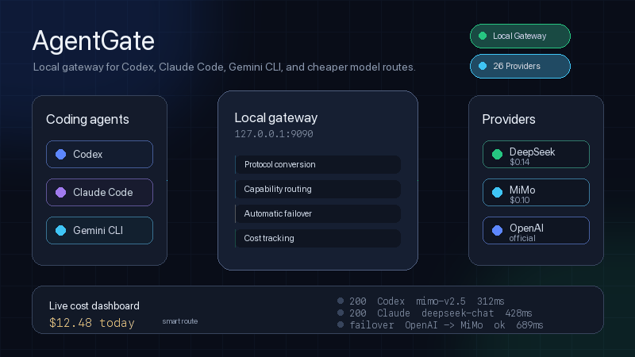
</p>

## Download for your OS

| Your machine | Download |
|---|---|
| 🍎 macOS — Apple Silicon (M1–M4) | [AgentGate_1.4.2_aarch64.dmg](https://github.com/dengmengmian/agentgate-ai/releases/download/v1.4.2/AgentGate_1.4.2_aarch64.dmg) |
| 🍎 macOS — Intel | [AgentGate_1.4.2_x64.dmg](https://github.com/dengmengmian/agentgate-ai/releases/download/v1.4.2/AgentGate_1.4.2_x64.dmg) |
| 🪟 Windows 10 / 11 | [AgentGate_1.4.2_x64-setup.exe](https://github.com/dengmengmian/agentgate-ai/releases/download/v1.4.2/AgentGate_1.4.2_x64-setup.exe) |
| 🐧 Linux — Debian / Ubuntu | [AgentGate_1.4.2_amd64.deb](https://github.com/dengmengmian/agentgate-ai/releases/download/v1.4.2/AgentGate_1.4.2_amd64.deb) |
| 🐧 Linux — other distros | [AgentGate_1.4.2_amd64.AppImage](https://github.com/dengmengmian/agentgate-ai/releases/download/v1.4.2/AgentGate_1.4.2_amd64.AppImage) |

> Headless CLI (`agentgate-serve`) tarballs and all versions: [Releases](https://github.com/dengmengmian/agentgate-ai/releases)

## Why AgentGate

| Official experience intact | Model routing is yours | Every request visible |
|:---|:---|:---|
| Keep AI agent clients usable the way they expect, with one-click restore to official configs | Let official client requests enter AgentGate first, then convert or pass through to your chosen upstream | Trace route decisions, converted payloads, upstream errors, tokens, cost, latency, and failover attempts |

## 5-Minute Quick Start

1. Download AgentGate from the table above and install it.
2. Open **Quick Setup** or **Providers**, then paste your provider API key.
3. Click **Start Gateway** on **Overview** or **Gateway**. The default client endpoint is `127.0.0.1:9090`.
4. On **Clients**, click **Apply Config** for Codex / Claude Code / OpenCode / Gemini CLI / AtomCode.
5. Send a test message in the client. Click **Switch to Official** whenever you want to restore the original client config.

AgentGate fills common base URLs, protocols, model defaults, and capability matrices from provider presets. Most users do not need to touch model mapping or advanced endpoint fields at first.

---

AgentGate is a **local control point for AI agent model requests**. It takes requests that would normally go straight to official endpoints, brings them into your desktop first, then decides whether to convert protocols or pass through natively to 26 providers including Xiaomi MiMo, DeepSeek, OpenAI, Anthropic, GitHub Copilot, Kimi, GLM, DashScope, SiliconFlow, Volcengine, and more.

> **Take back model choice for your AI agents.** Codex, Claude Code, Gemini CLI, OpenCode, and AtomCode keep their familiar client flow, while AgentGate handles upstream choice, protocol differences, failover, cost, and traceability locally.

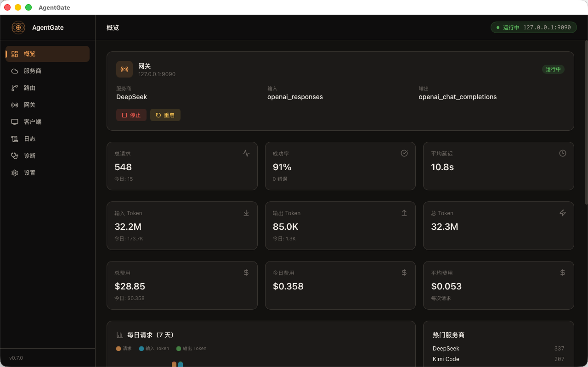

It is built for real integration problems:

- Codex speaks the Responses API, while many providers only expose Chat Completions or Anthropic-compatible Messages.
- Codex Desktop plugin and account features expect the official OpenAI-authenticated provider path; many third-party API proxies break that shape.
- Claude Code can directly use DeepSeek / MiMo Anthropic-compatible endpoints, but base URLs, model names, and mapping rules are easy to misconfigure.
- Different models from the same provider have different capabilities; sending images, tools, or `web_search` to the wrong model often causes 400 errors.
- Multiple providers and multiple API keys should fail over automatically, with request logs, token stats, and cost tracking.
- Switching models should not mean hand-editing `~/.codex/config.toml` or `~/.claude/settings.json`.

AgentGate's job is: **make the official client entry point local and controllable** — one-click client apply / restore, protocol conversion when needed, native pass-through when possible, route profiles, failover, request logs, cost tracking, and diagnostics.

## How It Compares

There are great LLM proxies out there. AgentGate's niche is **AI agent clients on the desktop** — it focuses on preserving client behavior while moving the model entry point into a local GUI you control, not operating a shared API server.

| Tool | What it's best at | How AgentGate differs |
|---|---|---|
| **Plain proxy** | Swapping a base URL | Keeps client-specific behavior, converts protocols when needed, supports native pass-through, and traces the full request path |
| **claude-code-router** | Routing Claude Code (CLI) to other models | Also covers Codex Responses API, Gemini CLI, OpenCode — plus a GUI and cost dashboard |
| **one-api / new-api** | Multi-user API reselling & billing on a server | Local-first, single-user, no account system; one-click client config built in |
| **LiteLLM** | A Python SDK / proxy for 100+ LLMs in your own app | A desktop control point for AI agent clients, not a library — zero code, GUI-driven |

> Positioning is approximate and these tools evolve fast — pick what fits your workflow. If you operate a shared API server, one-api / LiteLLM may suit you better; if you live in Codex / Claude Code, this is built for you.

## Common Use Cases

Guides: [Codex Desktop plugins](./use-codex-desktop-with-third-party-api-and-plugins.md) · [Codex + DeepSeek](./use-codex-with-deepseek.md) · [Codex + Xiaomi MiMo](./use-codex-with-mimo.md) · [Claude Code + DeepSeek](./use-claude-code-with-deepseek.md) · [Claude Code + GitHub Copilot](./use-claude-code-with-github-copilot.md) · [Gemini CLI](./use-gemini-cli-with-agentgate.md) · [OpenCode](./use-opencode-with-agentgate.md)

| Goal | What AgentGate does |
|---|---|
| Use Codex with DeepSeek | Converts Codex's OpenAI Responses API requests to DeepSeek-compatible Chat Completions or Anthropic-compatible endpoints. |
| Use Codex with Xiaomi MiMo | Turns Codex's Responses entry into a local AgentGate entry, then routes to MiMo models with model mapping, reasoning support, and capability checks. |
| Run Claude Code on a GitHub Copilot subscription | Exchanges your GitHub token for Copilot credentials automatically and tags tool continuations / compaction as agent traffic so they don't consume premium requests. See [the dedicated section](#run-claude-code--codex-on-your-github-copilot-subscription). |
| Long sessions on small-context models | When history exceeds the model's context window, the gateway auto-summarizes the middle of the conversation (keeping system + recent turns verbatim) — a 128K-window model survives 300K+ token sessions. |
| Use Codex Desktop plugins with third-party APIs | Keeps Codex Desktop on its official OpenAI-authenticated provider path so plugin and account features can keep working while model requests route through AgentGate. |
| Use Claude Code with DeepSeek / MiMo | Uses Anthropic-compatible pass-through plus model mapping for DeepSeek and MiMo endpoints. |
| Switch Codex between providers | One local endpoint lets Codex switch between DeepSeek, MiMo, OpenAI, Kimi, GLM, DashScope, and more without hand-editing config files. |

<a id="run-claude-code--codex-on-your-github-copilot-subscription"></a>

## Optional: Run Claude Code / Codex on Your GitHub Copilot Subscription

If you have a Copilot subscription (Pro / Business), Claude Code can run on the Claude models it includes — **no separate Anthropic API billing**. AgentGate handles three things:

1. **Credential exchange**: you provide a GitHub OAuth token (`gho_...`); the gateway exchanges and renews the Copilot API credential automatically (cached by hash, never stored in plaintext).
2. **Premium-request optimization**: most agent-workflow requests are tool-result continuations and history compaction — AgentGate tags those `x-initiator: agent`, so **only the messages you actually send consume premium requests**. One instruction with 10 tool round-trips counts as 1.
3. **Model name normalization**: `claude-sonnet-4-6` from Claude Code becomes the `claude-sonnet-4.6` form the Copilot endpoint expects — no mapping needed.

**Steps:**

1. Get a GitHub token: if you're signed into VS Code Copilot, read `oauth_token` from `~/.config/github-copilot/apps.json`.
2. AgentGate → Providers → Add, choose type **GitHub Copilot**, paste the `gho_` token as the API key (base URL and models auto-fill).
3. Apply the Claude Code config on the Clients page and start chatting. The Logs page shows the `x-initiator` classification per request.

> ⚠️ **Risk disclosure**: using a Copilot subscription outside official clients is a gray area under GitHub's Terms of Service. Similar community tools have existed for a long time without mass enforcement, but **account risk cannot be ruled out — evaluate it yourself**, and avoid important corporate accounts. This feature is entirely opt-in; if you never add a copilot-type provider, none of this applies.

## Three Modes

| Mode | When it happens | Model handling | Typical case |
|---|---|---|---|
| **Protocol Conversion** | Client protocol differs from upstream protocol | Model Mapping wins; otherwise provider default model is used as a compatibility fallback | Codex Responses → DeepSeek / MiMo Chat |
| **Native Pass-through** | Client protocol matches a native upstream endpoint | Request `model` is preserved unless a Model Mapping matches; the virtual `agentgate` model resolves to the model selected by routing | OpenCode / curl → Chat Completions |
| **Pass-through + Model Mapping** | Protocol matches, but client model names differ from upstream names | Model Mapping rewrites `model` | Claude Code `claude-*` → DeepSeek / MiMo model |

Rule of thumb: **protocol match decides pass-through vs conversion; Model Mapping only renames models.** For one-click client integrations, `agentgate` is a virtual model name that means "let AgentGate pick the provider model for this request."

## Features

**Protocol Conversion — 4 formats, bidirectional**
- OpenAI Responses API (`/v1/responses`) → Chat Completions / Claude Messages / Gemini API, for Codex
- Anthropic Messages API (`/v1/messages`) → Chat Completions conversion / Anthropic pass-through, for Claude Code
- Google Gemini API (`/v1beta/models/:model:generateContent`) → Chat Completions conversion, for Gemini CLI
- Chat Completions (`/v1/chat/completions`) pass-through forwarding
- Native Anthropic Claude API: `tool_use`/`tool_result`, `input_schema`, `thinking.budget_tokens`
- Native Gemini API: `contents`/`functionCall`/`functionResponse`, `generationConfig`
- Full DeepSeek reasoning_content (thinking mode) support without degradation
- Automatic request retry (429/5xx, exponential backoff, Retry-After)
- **Auto-compaction for long histories**: when history exceeds the model's context window (adaptive threshold at 85% of the cataloged window, per-model overridable), the gateway summarizes the middle of the conversation while keeping system and recent turns verbatim — small-window models survive very long sessions instead of hitting 400
- **Quality-first thinking**: conversions targeting Claude models enable thinking whenever the model supports it (adaptive for newer models, budget for older ones) while guarding the Anthropic constraints (budget bounds, sampling params, forced tool choice) that would otherwise 400
- **Automatic prompt-cache injection**: Anthropic-bound requests (both conversion and pass-through) get `cache_control` breakpoints at tools / system / history — budget-aware, never exceeding the 4-breakpoint limit; cache savings show up directly in the cost dashboard

**Cost Tracking & Multi-Key Pooling**
- 22+ built-in model prices, auto-calculate cost per request
- Dashboard: total/today/average cost cards, plus cost breakdown **by model, by client, and by route**, scoped to a time range (7/30 days)
- Settings: inline price editing, custom price overrides
- Multi-API-key per provider: round-robin rotation, auto-switch on 429

**Smart Routing**
- Task-level routing conditions: route by input size, images, tools, system keywords
- Failover selection strategy per route: **priority** (default) / **cheapest** (by model unit price) / **fastest** (by recent gateway latency)
- Preset scenes: Image Requests / Reasoning / Background / Long Text / Tool-Heavy
- Prompt cache injection for Anthropic (auto `cache_control`, ~90% input cost savings)
- Cache support auto-detection on provider test

**Gateway Refiner Layer (opt-in, off by default)**
- By default the gateway forwards requests/responses byte-for-byte; nothing is rewritten until you opt in
- Three independent refiners, each behind a global master switch in Settings, with a per-provider override that can force-off (never force-on):
  - **Request field filter** — strips request fields a provider rejects, based on its quirks, to avoid 400s
  - **Reasoning param correction** — normalizes `thinking.budget_tokens` / `reasoning.effort` to the provider's accepted shape and range
  - **Error response normalization** — rewrites upstream error bodies into the shape the client (Codex / Claude Code / Gemini CLI) expects
- Provider quirks come from built-in defaults, overridable per provider; every refiner action is recorded in the request log's `trace_json`

**Multimodal Support & Per-Model Capability Matrix**
- Image content is fully preserved during protocol conversion (`input_image`/`image_url` → Chat Completions `image_url`, Anthropic `image source` format)
- Per-model capability matrix tracks 8 dimensions per model: `text` / `vision` / `audio_in` / `tts` / `video_in` / `reasoning` / `tools` / `web_search`
- Capability-aware promotion: when a request includes images, the gateway auto-swaps to a sibling model that supports vision (e.g. routes image requests to `mimo-v2.5` instead of `mimo-v2.5-pro` on the same provider)
- Promotion ranking prefers the substitute that preserves the most of the original model's other capabilities, with `supported_models` order as tiebreak
- The capability matrix also drives tool emission: unchecking `web_search` for a model stops the gateway from sending the builtin to that model
- Matrix auto-seeded from model-name patterns: built-in rules for MiMo / DeepSeek / Kimi / Moonshot, with a generic fallback for others
- Provider test button now combines connectivity check + non-destructive matrix autofill (preserves manual edits)
- In failover mode, requests with images skip providers whose matrix declares no vision-capable model
- Providers that don't support images at the chosen model strip the image content at the provider-specific layer, avoiding upstream 400/404

**Multi-Provider Management**
- **26 built-in presets** (auto-fill base URL / protocols / Anthropic endpoint / default model):
  - **Domestic**: Xiaomi MiMo, DeepSeek, Kimi/Moonshot, MiniMax, GLM (Zhipu BigModel), DashScope (Aliyun Qwen), SiliconFlow, Volcengine (Doubao), Baichuan, StepFun, SenseNova, ModelScope, Yi (01.AI)
  - **International**: OpenAI, Anthropic (Claude), GitHub Copilot, Google Gemini, xAI (Grok), Mistral, Groq, Together, Fireworks, Cerebras, Perplexity, Cohere
  - **Aggregator**: OpenRouter
  - **Custom**: any OpenAI-compatible endpoint (vLLM / Ollama / LiteLLM / local proxies)
- MiMo first-class support: 5 chat models (`mimo-v2.5-pro` / `mimo-v2-pro` / `mimo-v2.5` / `mimo-v2-omni` / `mimo-v2-flash`), multi-turn `reasoning_content` round-trip, `sk-*` / `tp-*` keys auto-route to the correct Open API or Token Plan host, region-aware Token Plan URLs (`cn` / `sgp` / `ams`), and automatic `web_search` degradation when the paid plugin is unavailable
- Claude Code passthrough for MiMo / DeepSeek uses ordinary provider model IDs by default; AgentGate no longer auto-configures `[1m]` suffixed models.
- Route Profiles with multi-provider priority chains, auto-matched by protocol
- Manual switching or automatic failover
- Provider cooldown and runtime status tracking
- Per-request failover: Provider A fails → automatically tries Provider B
- Capability-aware routing: requests with images / audio / etc. auto-route to capable models within a provider, fall back to capable providers across the chain
- New providers are automatically added to all route chains
- Automatic model list fetching from providers
- Connection stability: HTTP client tuned with `pool_idle_timeout` and `tcp_keepalive`, plus app-layer retry on transient connect/timeout errors (avoids stale keep-alive failures after a pause)

**Client Configuration**
- Codex: one-click config + toggle between official and AgentGate (preserves conversations)
- Codex Desktop compatibility: routes model requests to third-party APIs while preserving the official OpenAI provider path, signed-in account state, and plugin/account feature compatibility
- Claude Code: one-click config + toggle between official and AgentGate
- OpenCode: one-click config
- Claude Desktop (macOS / Windows): point its third-party inference gateway at AgentGate; one-click apply with history rollback
- Global instruction files: edit `~/.claude/CLAUDE.md` / `~/.codex/AGENTS.md` from inside AgentGate with 6 built-in templates grouped by purpose (general / coding / review / debug / security / docs); overwrite or append, with auto-snapshot, one-click rollback, and JSON backup/restore
- MCP servers: read, add, edit, delete, and sync MCP server configs across Codex and Claude Code from one panel; env values are never shown in the list; JSON import/export with keys excluded by default
- Local skills: list, enable/disable, and delete skills under `~/.claude/skills` and `~/.codex/skills`; install from a local `.zip` (zip-slip guarded, no network download) and JSON backup/restore
- Local gateway access token (`ag_local_*`) authentication

**Desktop Experience**
- System tray background operation when the window is closed
- Auto-start on system boot, in-app updates, bilingual UI, 8 built-in themes
- Optional desktop pet for gateway status, request stats, and error bubbles; it can be disabled in Settings

**Quick Setup & Diagnostics**
- First-run onboarding: paste API key → auto-detect provider → select tools → one-click setup
- Quick-add provider: paste an API key; known prefixes are detected automatically, ambiguous prefixes can be selected manually
- Connection test: 3-step status bar (Config → Gateway → Provider) on the Clients page
- Quick Setup page in sidebar (auto-hidden after providers configured, re-enable in Settings)

**Diagnostics & Observability**
- Request logs, token stats, cost estimates, and provider runtime status
- Provider failure state visible on cards: cooldown / consecutive failures / quota exhausted, with one-click reset
- Active health probing (optional, off by default since probes consume a few tokens): periodic minimal probe per provider, shown on the card; when enabled it also seeds cold-start latency for the "fastest" routing strategy (providers with no recent traffic no longer sort blindly last)
- Self-check and redacted diagnostic bundle export
- Capability degradation events: image stripping, web_search downgrade, MCP advisory, and omitted tool-output images

## Screenshots

| Overview | Providers |
|:---:|:---:|
|  | 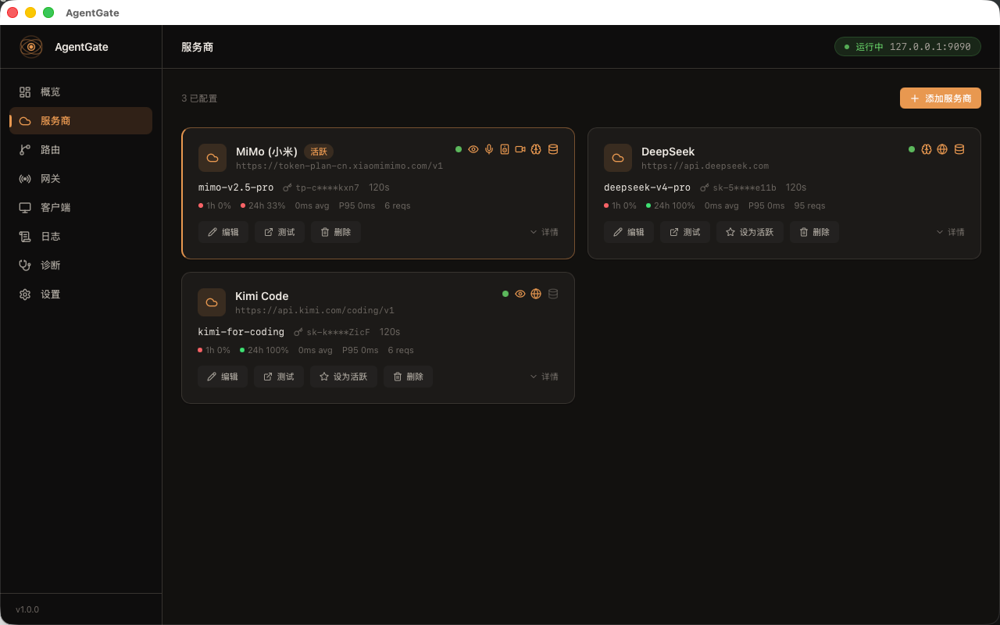 |

| Routes | Gateway |
|:---:|:---:|
| 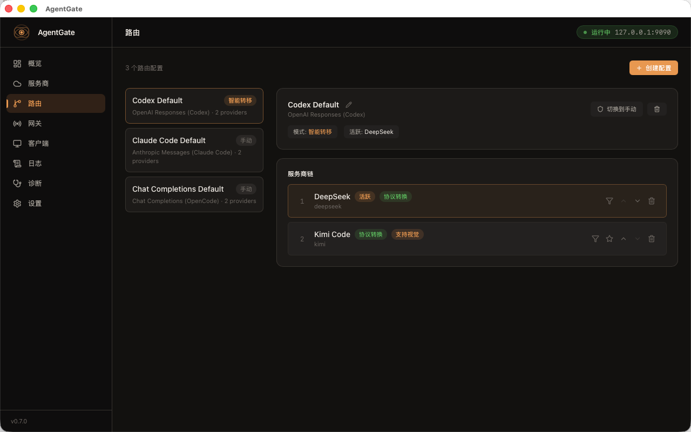 | 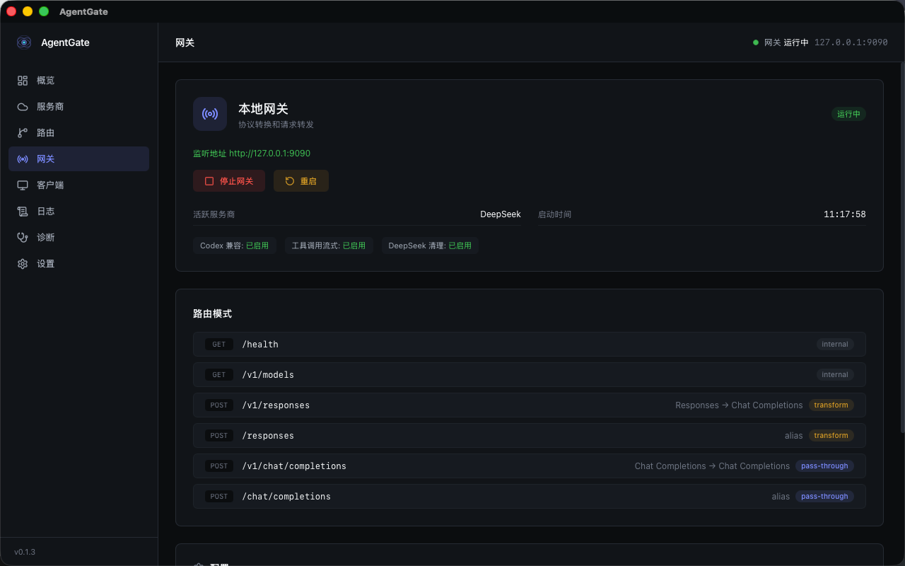 |

| Clients | Logs |
|:---:|:---:|
| 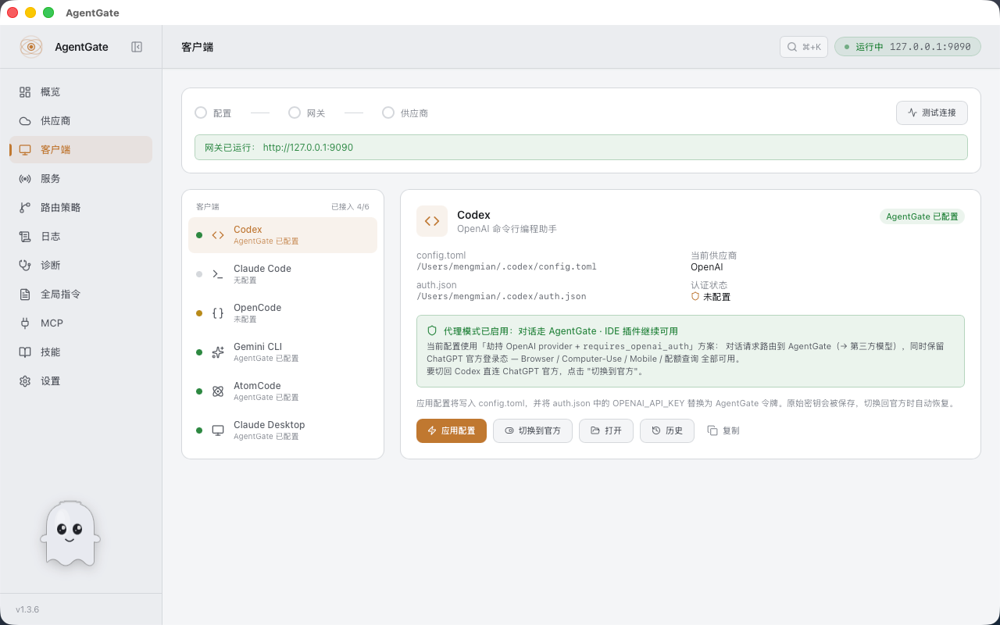 | 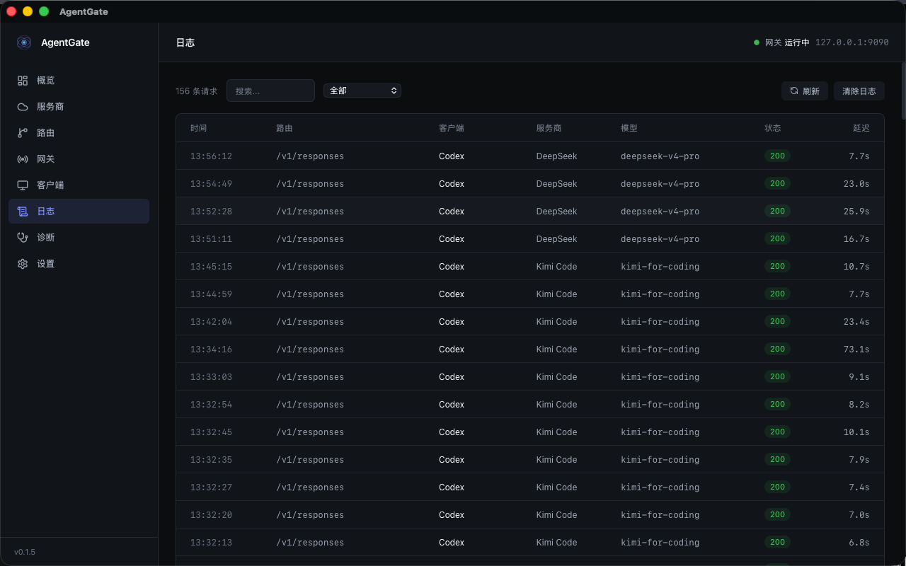 |

| Diagnostics | Settings |
|:---:|:---:|
| 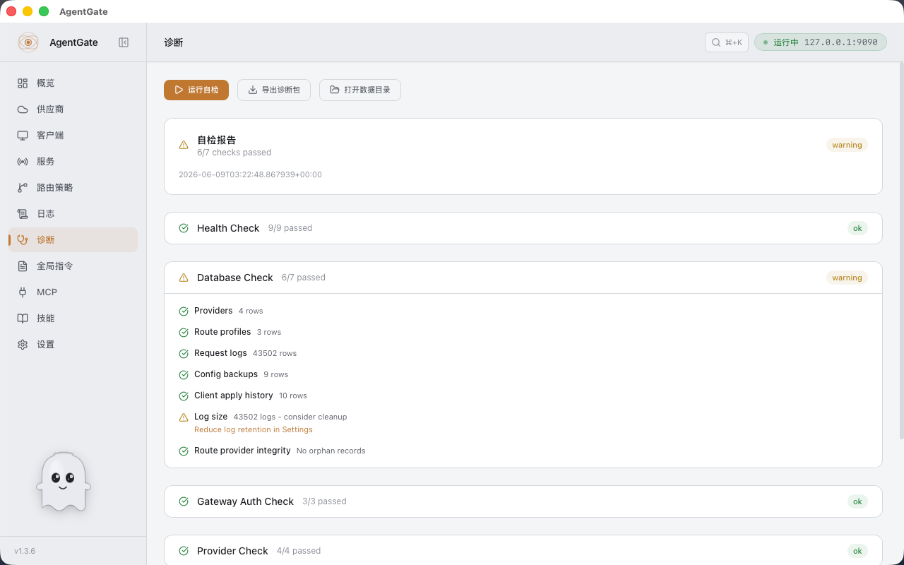 | 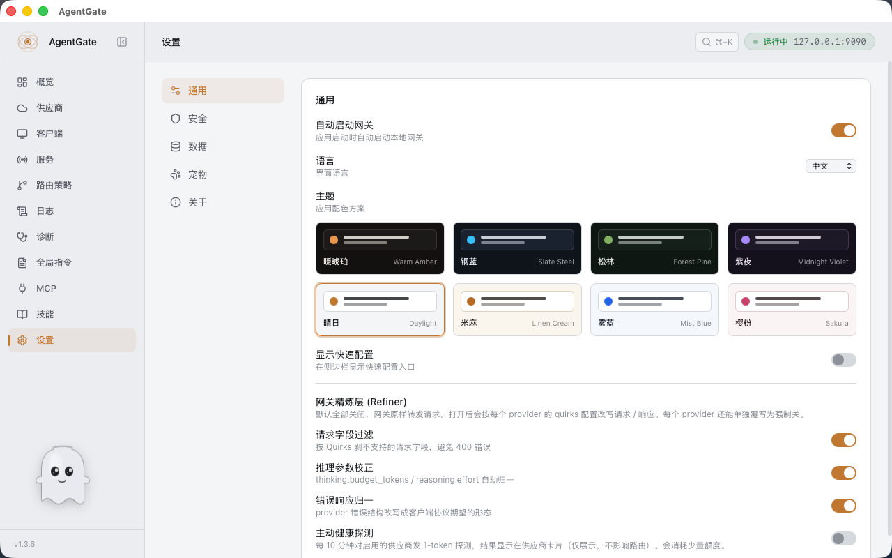 |

| Global Instructions | MCP Servers |
|:---:|:---:|
| 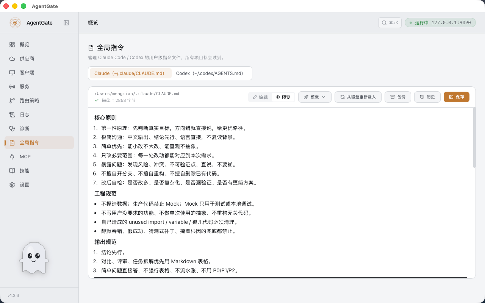 | 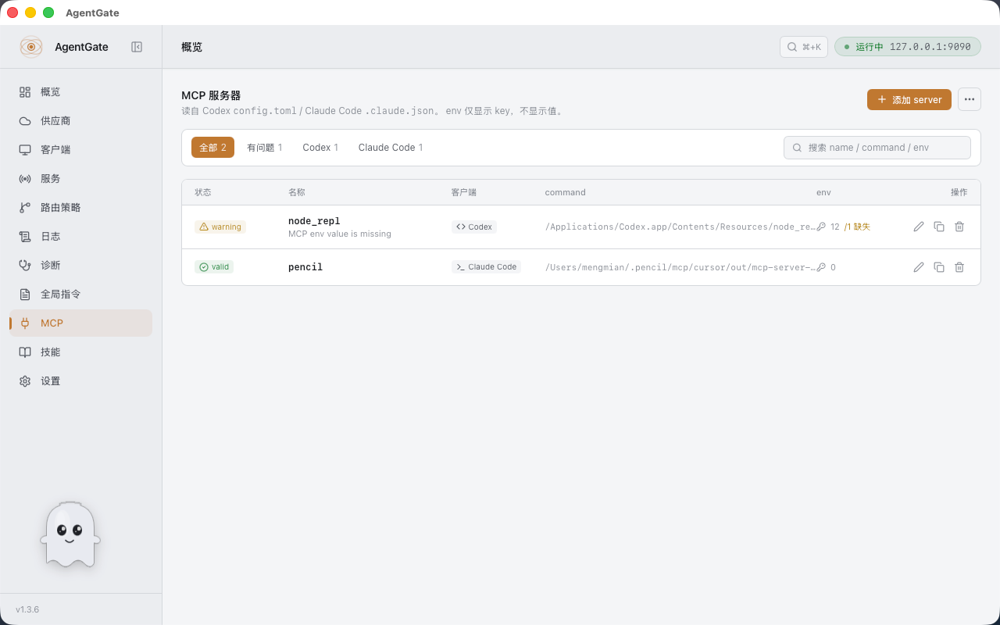 |

| Skills | Quick Setup |
|:---:|:---:|
| 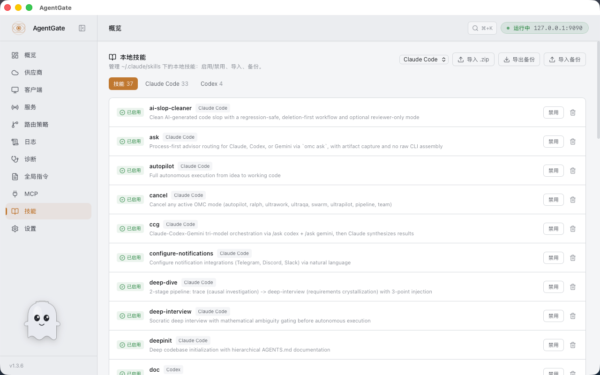 | 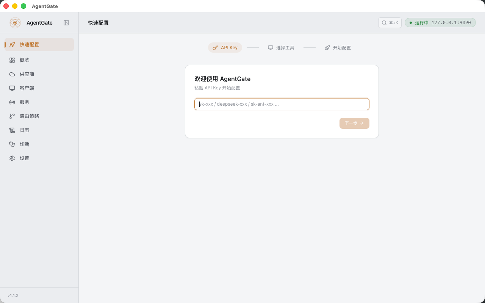 |

| Pet Settings | Desktop Pet |
|:---:|:---:|
| 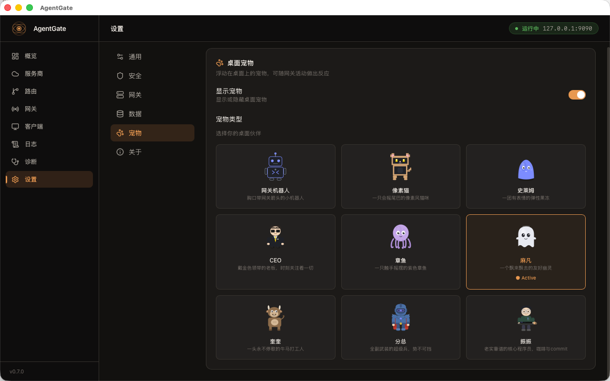 |  |

## Tech Stack

| Layer | Technology |
|---|---|
| Desktop Framework | Tauri v2 |
| Frontend | React 19 + TypeScript + Tailwind CSS v4 |
| Backend | Rust + Tokio + Axum |
| Database | SQLite (rusqlite, WAL mode) |
| HTTP Client | reqwest |

## Installation & Build

### Download

Download the installer for your platform from the [Releases](../../releases) page.

| Platform | Format |
|---|---|
| macOS (Apple Silicon) | `.dmg` (aarch64) |
| macOS (Intel) | `.dmg` (x86_64) |
| Windows | `.exe` |
| Linux | `.AppImage` / `.deb` |

> **Platform support**: the core gateway (protocol conversion, routing, failover, cost dashboard, client config apply/restore) works on all three platforms. Convenience features (Codex auto-restart after config apply, Claude Desktop integration, running-client detection) support macOS and Windows (the Windows implementations are recent — please file an issue if anything misbehaves); on Linux, restart the client manually after applying config. Contributions welcome.

<details>
<summary><b>macOS: "Cannot verify the developer"?</b> (click to expand)</summary>

If macOS Gatekeeper blocks the app, use one of these options:

**Option 1: System Settings (recommended)**
1. Double-click AgentGate, click **Cancel** on the prompt
2. Open **System Settings → Privacy & Security**
3. Scroll down, find `"AgentGate" was blocked` → click **Open Anyway**
4. Open AgentGate again, click **Open**

**Option 2: Right-click open**
1. Find AgentGate.app in Finder
2. Hold **Control** and click (or right-click) → select **Open**
3. Click **Open** on the prompt

**Option 3: Terminal**
```bash
xattr -d com.apple.quarantine /Applications/AgentGate.app
```

> Only needed once.

</details>

<details>
<summary><b>Windows SmartScreen warning?</b> (click to expand)</summary>

On first run, SmartScreen may show a warning:
1. Click **More info**
2. Click **Run anyway**

> Only needed once.

</details>

### Build from Source

**Prerequisites**

- Node.js >= 20
- pnpm >= 10
- Rust >= 1.75
- macOS / Windows / Linux

**Install Dependencies**

```bash
pnpm install
```

**Development Mode**

```bash
pnpm tauri dev
```

**Build**

```bash
pnpm tauri build
```

## Headless / Server Mode

Run AgentGate without GUI — for servers, CI, Docker, and team deployments.

```bash
# Add a provider
agentgate-serve provider-add -t deepseek -k sk-xxx

# Start the gateway
agentgate-serve serve --host 0.0.0.0 --port 9090

# Other commands
agentgate-serve provider-list          # list all providers
agentgate-serve provider-remove NAME   # remove provider
agentgate-serve token                  # show access token
agentgate-serve status                 # show config summary
```

Provider presets auto-fill base URL and model for: `deepseek`, `openai`, `anthropic`, `kimi`, `minimax`, `groq`, `together`, `google_gemini`, `xai`, `mistral`.

**Docker:**

```bash
docker compose up
# or
docker build -t agentgate . && docker run -p 9090:9090 \
  -e AGENTGATE_PROVIDER=deepseek -e AGENTGATE_API_KEY=sk-xxx agentgate
```

**Environment variables:** `AGENTGATE_HOST`, `AGENTGATE_PORT`, `AGENTGATE_DB_PATH`, `AGENTGATE_PROVIDER`, `AGENTGATE_API_KEY`.

## Usage Guide

Most users only need the [5-Minute Quick Start](#5-minute-quick-start) above. Expand for the full reference.

<details>
<summary><b>Full usage guide — providers, clients, API calls, failover, capability routing, diagnostics</b></summary>

### 1. Add a Provider

Launch AgentGate → **Providers** → **Add Provider**

**Fast path (recommended) — paste API key:**

1. Paste your provider API key into the top input
2. AgentGate detects known key prefixes (`sk-ant-` / `deepseek-` / `gsk_` / …). If the prefix is ambiguous, select the provider type manually
3. Click **Create** — name, base URL, protocols, default/reasoning model, capabilities are all filled in for you. Done.

**Manual mode — 3 sections, only Section A is required:**

| Section | Fields | Notes |
|---|---|---|
| **Basic** | Type · Name · API Key (+ Base URL only if `custom` type) | Picking a type auto-fills everything else from the preset |
| **Models & Capabilities** | Default model · Reasoning model · `Fetch & detect` button · capability matrix toggle | On a freshly created provider, this is **auto-run in the background** — you get newest non-mini model as default + newest reasoning model + per-model capability matrix without clicking anything |
| **Advanced** *(collapsed, "usually no need to touch")* | Protocols + their endpoints (Chat / Responses / Anthropic) · Extra Headers · Timeout · Auto cache control · Model Mapping | Each protocol you tick shows its own URL — one place to read "which native endpoints this upstream supports" |

**Model Mapping** is at the bottom of Advanced for a reason: usually not needed. AgentGate auto-fills recommended MiMo / DeepSeek mappings when you create the provider, fetch models, test the provider, or apply Codex / Claude Code config. Existing mappings are preserved. Native pass-through keeps `model` unchanged unless a mapping matches or the client sends the virtual `agentgate` model; protocol conversion uses mapping first, then falls back to `default_model` for compatibility with clients like Codex, Claude Code, and Gemini CLI.

**Provider configuration examples:**

<details>
<summary>DeepSeek</summary>

| Field | Value |
|---|---|
| Name | `DeepSeek` |
| Type | `deepseek` |
| Base URL | `https://api.deepseek.com` |
| Default Model | `deepseek-v4-flash` |
| Reasoning Model | `deepseek-v4-pro` |
| Model Mapping | `gpt-5.5` → `deepseek-v4-flash`, `o3` → `deepseek-v4-pro` |
| Anthropic Endpoint | `https://api.deepseek.com/anthropic` (supports Claude Code pass-through) |

</details>

<details>
<summary>KimiCoding (Moonshot)</summary>

| Field | Value |
|---|---|
| Name | `KimiCoding` |
| Type | `kimi` |
| Base URL | `https://api.moonshot.cn` |
| Default Model | `kimi-k2` |
| Extra Headers | `{"User-Agent":"KimiCLI/1.40.0"}` |
| Model Mapping | `gpt-5.5` → `kimi-k2` |

> KimiCoding supports Vision and can serve as a failover target for image requests.

</details>

<details>
<summary>OpenAI</summary>

| Field | Value |
|---|---|
| Name | `OpenAI` |
| Type | `openai` |
| Base URL | `https://api.openai.com` |
| Default Model | `gpt-4o` |
| Responses API Endpoint | `https://api.openai.com` (OpenAI natively supports Responses API, uses pass-through) |
| Model Mapping | Usually not needed (client model names used directly) |

</details>

<details>
<summary>Anthropic (Claude)</summary>

| Field | Value |
|---|---|
| Name | `Anthropic` |
| Type | `anthropic` |
| Base URL | `https://api.anthropic.com` |
| Default Model | `claude-sonnet-4-6` |
| Model Mapping | `gpt-5.5` → `claude-sonnet-4-6` |

> When type is set to `Anthropic (Claude)`, Codex requests are automatically converted using Claude Messages API native format (`tool_use`/`tool_result`/`input_schema`), rather than being converted to Chat Completions.

</details>

<details>
<summary>MiniMax</summary>

| Field | Value |
|---|---|
| Name | `MiniMax` |
| Type | `minimax` |
| Base URL | `https://api.minimax.chat` |
| Default Model | `MiniMax-M1` |
| Model Mapping | `gpt-5.5` → `MiniMax-M1` |

</details>

<details>
<summary>OpenRouter</summary>

| Field | Value |
|---|---|
| Name | `OpenRouter` |
| Type | `openrouter` |
| Base URL | `https://openrouter.ai/api` |
| Default Model | `deepseek/deepseek-v4-flash` |
| Model Mapping | `gpt-5.5` → `deepseek/deepseek-v4-flash` |

</details>

<details>
<summary>Custom OpenAI Compatible</summary>

| Field | Value |
|---|---|
| Name | Your custom name |
| Type | `custom_openai_compatible` |
| Base URL | Your server URL, e.g., `http://localhost:8000` |
| Default Model | Your model name |

> Works with any OpenAI Chat Completions API-compatible service (e.g., vLLM, Ollama, LiteLLM).

</details>

**After saving:**

- Fetch + capability detection runs automatically in the background — no manual action needed
- Click **Test Connection** to verify the config — it opens a single dialog with 3 live steps: **Connectivity & auth** → **Capability autofill** → **Prompt cache detection** (auto-skipped for non-Anthropic providers)

### 2. Start the Gateway

**Overview** or **Gateway** page → **Start Gateway**

Listens on `127.0.0.1:9090` by default.

### 3. Configure Codex

**Clients** → **Codex** → **Apply Config**

AgentGate will automatically:

- Save original `~/.codex/config.toml` and `auth.json`
- Write AgentGate provider settings and local token

Click **Switch to Official** to restore the original config at any time — conversations are preserved.

### 4. Configure Claude Code

**Clients** → **Claude Code** → **Apply Config**

AgentGate writes to `~/.claude/settings.json`, setting `ANTHROPIC_BASE_URL` to the local gateway and `ANTHROPIC_API_KEY` to the AgentGate local token.

Click **Switch to Official** to restore the original settings.json.

### 5. Configure OpenCode

**Clients** → **OpenCode** → **Apply Config**

AgentGate writes to `~/.config/opencode/opencode.json`, configuring an OpenAI-compatible provider pointing to the local gateway. It uses `openai/agentgate` as a virtual model so switching providers in AgentGate does not require editing OpenCode again.

### 6. Configure Gemini CLI

**Clients** → **Gemini CLI** → **Apply Config**

AgentGate writes Gemini CLI's config to point at the local gateway's `/v1beta/...` route (Gemini-compatible). One-click toggle back to official.

### 7. Configure AtomCode

**Clients** → **AtomCode** → **Apply Config**

AtomCode integration writes its config to use AgentGate as the upstream — same toggle pattern as the others. It uses `agentgate` as a virtual model so the gateway can resolve DeepSeek / MiMo / other provider model names at request time.

### 8. Direct API Calls

All endpoints (except `/health`) require a local access token.

**Getting the token:**

- **Copy from UI**: AgentGate → **Settings** → **Gateway Auth** → click the copy button next to the token
- **Read from terminal**:
  ```bash
  TOKEN=$(cat ~/.agentgate/token)
  ```
- **Regenerate**: **Settings** → **Regenerate Token** (old token is immediately invalidated)

The token format is `ag_local_*`. It is only used for local gateway auth and is never forwarded to upstream providers.

**Chat Completions (Pass-through)**

```bash
curl -X POST http://127.0.0.1:9090/v1/chat/completions \
  -H "Authorization: Bearer $TOKEN" \
  -H "Content-Type: application/json" \
  -d '{"model":"deepseek-v4-flash","messages":[{"role":"user","content":"Hello"}]}'
```

**Responses API (Codex Protocol)**

```bash
curl -X POST http://127.0.0.1:9090/v1/responses \
  -H "Authorization: Bearer $TOKEN" \
  -H "Content-Type: application/json" \
  -d '{"model":"gpt-5.5","input":"Hello","stream":true}'
```

**Messages API (Claude Code Protocol)**

```bash
curl -X POST http://127.0.0.1:9090/v1/messages \
  -H "Authorization: Bearer $TOKEN" \
  -H "Content-Type: application/json" \
  -d '{"model":"claude-sonnet-4-6","max_tokens":1024,"messages":[{"role":"user","content":"Hello"}]}'
```

**Model List**

```bash
curl http://127.0.0.1:9090/v1/models -H "Authorization: Bearer $TOKEN"
```

**Health Check (No Auth Required)**

```bash
curl http://127.0.0.1:9090/health
```

**Client says “network connection failed”?**

First check whether the gateway port is actually running:

```bash
curl http://127.0.0.1:9090/health
```

- If the connection fails: go back to AgentGate **Overview / Gateway / Clients** and click **Start Gateway**.
- If health works: use the **Clients** page connection test to narrow it down: Config → Gateway → Provider.
- `http://localhost:1420` is only the development UI; Codex / Claude Code / OpenCode / Gemini CLI / AtomCode call `http://127.0.0.1:9090`.

### 9. Multi-Provider & Failover

Configure Route Profiles on the **Routes** page:

1. Default routes are auto-created per protocol (Codex / Claude Code / OpenCode)
2. Add multiple providers to the provider chain, adjust priorities
3. Switch mode: manual / failover
4. In failover mode, 429/402/5xx/timeout errors automatically try the next provider

### 10. Capability-Aware Routing (Multimodal & Reasoning)

AgentGate tracks **per-model** capabilities across 8 dimensions and uses them for routing — when your request contains images / audio / tools, the gateway picks a model that actually supports it.

**Capability matrix per model:**

`text` · `vision` · `audio_in` · `tts` · `video_in` · `reasoning` · `tools` · `web_search`

**Setup:**

1. Add a provider — model list, capabilities, and best default/reasoning model are detected automatically right after creation
2. On the **Providers** page, the card shows capability icons + native pass-through chips (`Native Chat`, `Native Anthropic`, …)
3. To re-detect manually: open Edit → click **Fetch & detect capabilities**
4. On the **Routes** page, switch mode to **failover**

**How it works:**

- After provider creation: gateway calls upstream `/models`, runs name-pattern seeding for capabilities, picks newest non-mini model as default and newest reasoning-style model as reasoning_model
- When a request includes images, the gateway:
  - First tries to swap to a sibling model on the same provider that supports vision (e.g., `mimo-v2.5-pro` → `mimo-v2.5` for images)
  - If no sibling on the current provider, failover to next provider in the chain whose matrix declares a vision-capable model
- Capability matrix also gates tool emission — unchecking `web_search` for a model stops the gateway from sending the `web_search` builtin to that model
- Promotion picker prefers the candidate that preserves the most of the original model's other capabilities; `supported_models` order is the tiebreak
- Providers without any vision-capable model strip image content at the provider transform layer, avoiding upstream 400/404 on text-only fallback

**Example scenario:**

```
Codex sends a request with images
  → Gateway sees request has images
  → MiMo's matrix: mimo-v2.5-pro = text, mimo-v2.5 = text + vision
  → Promote mimo-v2.5-pro → mimo-v2.5 (same provider, capability match)
  → Request goes through, full image + text preserved
```

### 11. Diagnostics

On the **Diagnostics** page:

- **Run Self-Check** — checks gateway, provider, config, and database status
- **Export Diagnostic Bundle** — generates a redacted diagnostic report for troubleshooting
- Request log `trace_json` includes `degradation_events` when AgentGate strips unsupported capabilities such as images, native web search, MCP connectors, or tool-output images.

</details>

## Supported Providers

Providers marked **Provider-specific handling** have dedicated transform code in `src-tauri/src/transform/providers/`. The rest go through the generic Chat Completions / Anthropic pass-through path and work out-of-the-box.

<!-- PROVIDER_CATALOG_TABLE:START -->
| Provider | Type | Native Protocols | Provider-Specific Handling |
|---|---|---|---|
| Xiaomi MiMo | `mimo` | Chat + Anthropic | Multi-turn `reasoning_content` round-trip, region-aware `tp-*` host auto-routing, temperature strip in thinking mode, tool_choice non-auto strip, omni web_search strip, web_search builtin gated by matrix, Web Search Plugin auto-degrade / retry |
| DeepSeek | `deepseek` | Chat + Anthropic | Image stripping with explicit notice, DeepSeek V4 thinking history reasoning backfill, schema cleaning, message reordering |
| Anthropic (Claude) | `anthropic` | Anthropic | `tool_use`/`tool_result`, `input_schema`, thinking budget, native cache_control |
| GitHub Copilot | `copilot` | Chat + Anthropic | GitHub token → Copilot bearer exchange, `x-initiator` billing classification, Claude model dash→dot normalization |
| OpenAI | `openai` | Chat + Responses | None (Responses passthrough or Chat conversion) |
| Google Gemini | `google_gemini` | Chat | None |
| Kimi / Moonshot | `kimi` | Chat | `web_search` → `builtin_function`/`$web_search`, thinking control |
| MiniMax | `minimax` | Chat | Strip reasoning_effort / response_format, `<think>` extraction |
| GLM (Zhipu) | `glm` | Chat | Generic |
| DashScope (Qwen) | `dashscope` | Chat | Generic |
| SiliconFlow | `siliconflow` | Chat | Generic |
| Volcengine (Doubao) | `volcengine` | Chat | Generic |
| Baichuan | `baichuan` | Chat | Generic |
| StepFun | `stepfun` | Chat | Generic |
| SenseNova | `sensenova` | Chat | Drops null strict / response_format / non-function tools, merges system messages |
| Yi (01.AI) | `yi` | Chat | Generic |
| ModelScope | `modelscope` | Chat | Generic |
| xAI (Grok) | `xai` | Chat | Generic |
| Mistral | `mistral` | Chat | Generic |
| Groq | `groq` | Chat | Generic |
| Together | `together` | Chat | Generic |
| Fireworks | `fireworks` | Chat | Generic |
| Cerebras | `cerebras` | Chat | Generic |
| Perplexity | `perplexity` | Chat | Generic |
| Cohere | `cohere` | Chat | Generic |
| OpenRouter | `openrouter` | Chat | None |
| Custom | `custom_openai_compatible` | Chat | None (set Base URL yourself) |
<!-- PROVIDER_CATALOG_TABLE:END -->

> Vision / reasoning / tools / web_search capability is tracked **per-model** in the capability matrix, not at the provider level. See *Capability-Aware Routing* below.

## Architecture & Internals

<details>
<summary><b>Data flow, request modes, and gateway routes</b></summary>

### Data Flow

AgentGate separates protocol handling from model naming. There are three common request modes:

> **How to tell?** First check whether the client protocol matches a native provider endpoint. If it matches, the request is forwarded without protocol conversion. Model names are a separate concern: a matching Model Mapping can still rename `model`.

| Client | Sends | Downstream Provider | AgentGate Mode | Trigger |
|---|---|---|---|---|
| Codex | Responses API | Chat Completions | Protocol Conversion | Default (no special URL) |
| Codex | Responses API | Claude Messages API | Protocol Conversion | `provider_type` is `anthropic` |
| Codex | Responses API | Responses API | Native Passthrough | `responses_base_url` is configured |
| Claude Code | Messages API | Chat Completions | Protocol Conversion | No `anthropic_base_url` |
| Claude Code | Messages API | Anthropic-compatible endpoint | Native Passthrough + Model Mapping | `anthropic_base_url` is configured and `claude-*` maps to provider model |
| OpenCode | Chat Completions | Chat Completions | Native Passthrough | Same protocol and upstream model name |
| curl / New API etc. | Chat Completions | Chat Completions | Native Passthrough | Same protocol and upstream model name |

### Protocol Conversion

When the client protocol differs from the downstream provider, AgentGate converts the format. This is the most complex path, including vision-aware routing and provider-specific processing.

```
┌──────────────────┐    ┌──────────────────┐
│      Codex       │    │    Claude Code    │
│  (Responses API) │    │  (Messages API)   │
└────────┬─────────┘    └────────┬─────────┘
         │                       │
         ▼                       ▼
┌─────────────────────────────────────────────────────────────────────────┐
│                    AgentGate (127.0.0.1:9090)                           │
│                                                                         │
│  ① Auth: validate local token (ag_local_*)                              │
│                         ▼                                               │
│  ② Route Matching: match Route Profile by protocol                      │
│     /v1/responses → Codex Default                                       │
│     /v1/messages  → Claude Code Default                                 │
│                         ▼                                               │
│  ③ Protocol Conversion (shared layer)                                   │
│     Responses API → Chat Completions (input_image → image_url)          │
│     Messages API  → Chat Completions (image → image_url)                │
│                         ▼                                               │
│  ④ Capability-Aware Routing (failover mode)                             │
│     Has images → promote to vision sibling on same provider, or         │
│                  failover to next provider with a vision-capable model  │
│     No images  → select by priority as normal                           │
│                         ▼                                               │
│  ⑤ Provider-Specific Transform                                          │
│     DeepSeek   → strip images + reasoning_content + schema fix          │
│     KimiCoding → web_search conversion + thinking control               │
│     Anthropic  → convert to Claude Messages (image→source.base64)       │
│     Others     → send directly                                          │
│                         ▼                                               │
│  ⑥ Failover: 429/402/5xx/timeout → cooldown → try next provider        │
│                         ▼                                               │
│  ⑦ Logging → SQLite                                                    │
│                         ▼                                               │
│  ⑧ Response reverse-conversion: back to original protocol for client    │
└─────────┬───────────────────────────────┬───────────────────────────────┘
          │                               │
          ▼                               ▼
   ┌──────────────┐               ┌──────────────┐
   │   DeepSeek   │               │  KimiCoding  │  ...
   │  (text only) │               │ (text+image) │
   └──────────────┘               └──────────────┘
```

### Native Passthrough

When the client protocol matches the downstream provider, AgentGate does not convert the request format. It replaces the URL and credentials. Model handling follows one rule: Model Mapping wins; otherwise the request model is preserved. If the request model is `agentgate` or `openai/agentgate`, AgentGate resolves it to the model selected by routing for that request. If the client omits `model`, AgentGate uses the provider default.

```
┌──────────────────┐  ┌──────────────────┐  ┌──────────────────┐
│    Claude Code   │  │     OpenCode     │  │  curl / New API  │
│  (Messages API)  │  │(Chat Completions)│  │(Chat Completions)│
└────────┬─────────┘  └────────┬─────────┘  └────────┬─────────┘
         │                     │                      │
         ▼                     ▼                      ▼
┌─────────────────────────────────────────────────────────────────────────┐
│                    AgentGate (127.0.0.1:9090)                           │
│                                                                         │
│  ① Auth: validate local token (ag_local_*)                              │
│                         ▼                                               │
│  ② Route Matching: match Route Profile by protocol                      │
│     /v1/messages          → Claude Code Default                         │
│     /v1/chat/completions  → OpenCode Default                            │
│                         ▼                                               │
│  ③ Native Passthrough                                                   │
│     Replace target URL (base_url or anthropic_base_url)                 │
│     Inject provider API key                                             │
│     Optional model mapping (claude-* → mimo/deepseek model)             │
│     Forward request body as-is ──→ Proxy response stream as-is         │
│                         ▼                                               │
│  ④ Logging → SQLite                                                    │
└─────────┬───────────────┬───────────────────┬───────────────────────────┘
          │               │                   │
          ▼               ▼                   ▼
  ┌──────────────┐ ┌──────────────┐   ┌──────────────┐
  │  DeepSeek    │ │   OpenAI     │   │  New API     │  ...
  │  /anthropic  │ │              │   │  / aggregator│
  └──────────────┘ └──────────────┘   └──────────────┘

Trigger conditions:
  • /v1/messages    + Provider has anthropic_base_url → Messages API native passthrough
  • /v1/chat/completions → Chat Completions native passthrough (all providers)
```

### Flow Examples

**Codex with images (protocol conversion + vision-aware routing):**

```
Codex sends input_image
  → /v1/responses (Responses API)
  → ① Auth passes
  → ② Matches Codex Default Route Profile
  → ③ Protocol conversion: input_image → image_url (image preserved)
  → ④ Vision routing: image detected → skip DeepSeek (No Vision) → select KimiCoding (Vision)
  → ⑤ KimiCoding transform: no image stripping, send directly
  → ⑥ KimiCoding returns success → mark healthy
  → ⑦ Log request
  → ⑧ Reverse-convert to Responses API format → return to Codex
```

**Claude Code → DeepSeek (native passthrough + model mapping):**

```
Claude Code sends Messages API request
  → /v1/messages
  → ① Auth passes
  → ② Matches Claude Code Default Route Profile
  → ③ DeepSeek has anthropic_base_url → native passthrough
  → Model Mapping: claude-sonnet-4-6 → deepseek-v4-pro
  → Replace URL with api.deepseek.com/anthropic + inject API key
  → Request body proxied as-is → SSE response stream proxied as-is
  → ④ Log request
```

**OpenCode / curl / New API (native passthrough):**

```
Client sends Chat Completions request
  → /v1/chat/completions
  → ① Auth passes
  → ② Matches Route Profile
  → ③ Native passthrough: replace URL + API key; model unchanged unless mapping matches
  → Request body forwarded as-is → SSE response stream proxied as-is
  → ④ Log request
```

### Gateway Routes

| Method | Path | Mode | Description |
|---|---|---|---|
| GET | `/health` | internal | Health check (no auth) |
| GET | `/v1/models` | internal | Model list |
| POST | `/v1/responses` | auto | `responses_base_url` set → pass-through; Anthropic type → Claude conversion; otherwise → Chat Completions conversion |
| POST | `/v1/chat/completions` | pass-through | Chat Completions direct |
| POST | `/v1/messages` | auto | `anthropic_base_url` set → pass-through; otherwise → Chat Completions conversion |

</details>

## Project Structure

```
AgentGate/
├── provider-catalog/             # Provider/model source of truth for generated defaults
├── src/                          # Frontend (React)
│   ├── app/App.tsx               # App entry point
│   ├── pages/                    # Pages (Overview/Quick Setup/Providers/Routes/Gateway/Clients/Logs/Diagnostics/Instructions/MCP/Skills/Settings)
│   ├── components/               # UI components (layout/common/dashboard/providers/logs/tools/onboarding)
│   ├── pet/                      # Desktop pet system (PetApp/Bubble/greetings/9 pet SVG components)
│   ├── lib/                      # API wrapper, i18n, utilities
│   └── types/                    # TypeScript type definitions
├── src-tauri/                    # Backend (Rust)
│   └── src/
│       ├── gateway/              # HTTP gateway (server/routes/SSE/SSE Anthropic/pass-through/failover)
│       ├── protocol/             # Protocol types (Responses/ChatCompletions/Messages/SSE events)
│       ├── transform/            # Protocol conversion (responses→chat/responses→anthropic/schema cleanup/tool_calls/reasoning store/providers)
│       ├── providers/            # Provider adapters
│       ├── storage/              # SQLite storage layer
│       ├── models/               # Data models
│       ├── tools/                # Client config + MCP / skills / global instructions management
│       ├── security/             # Authentication & redaction
│       ├── diagnostics/          # Diagnostics & self-checks
│       ├── app/                  # Tauri commands & app state
│       └── errors/               # Unified error types
├── scripts/                      # Test and generation scripts
└── package.json
```

## Security

- Gateway uses local token authentication by default
- Provider API keys are stored only in local SQLite and never sent to clients
- Client tokens are never forwarded to upstream providers
- Request logs and diagnostic bundles redact secrets across the board: `sk-` keys, Bearer tokens, `x-api-key`, `api_key` fields, and Gemini-style `?key=` query params
- The desktop app binds only to `127.0.0.1`; headless mode (`agentgate-serve`) exposes the gateway only with an explicit `--host`, and ships Host / Origin validation against DNS rebinding (domain access requires the `AGENTGATE_ALLOWED_HOSTS` allowlist)
- Token file permissions set to `0600` (Unix)

## FAQ

**Are my API keys safe? Does AgentGate phone home?**
Keys live only in a local SQLite file on your machine and are never sent to clients or to any AgentGate server — there is no AgentGate backend. Your keys go only to the upstream provider you configured. The desktop app binds to `127.0.0.1`; only headless mode with an explicit `--host 0.0.0.0` exposes it, with built-in Host / Origin validation.

**Can running Claude Code on a Copilot subscription get my account banned?**
It's a gray area under GitHub's Terms of Service: similar community tools have existed for a long time without mass enforcement, but the risk can't be ruled out — see the [risk disclosure](#run-claude-code--codex-on-your-github-copilot-subscription). If you never add a copilot-type provider, none of this applies.

**Will it break my Codex / ChatGPT login or Codex Desktop plugins?**
No. AgentGate keeps Codex on the official OpenAI-authenticated provider path, so your signed-in account, plugins, Browser / Computer-Use / Mobile and quota lookup keep working while chat requests route to third-party models. **Switch to Official** restores the original config at any time — conversations are preserved.

**Can I run it offline / on a server without the GUI?**
Yes. Headless mode (`agentgate-serve`) and Docker run without a window — see [Headless / Server Mode](#headless--server-mode).

**Do I have to edit `config.toml` / `settings.json` by hand?**
No. One-click **Apply Config** writes them for you and backs up the originals; **Switch to Official** rolls back.

**A client says "network connection failed" — what now?**
First check the gateway is up: `curl http://127.0.0.1:9090/health`. If it fails, start the gateway from the app. Note `localhost:1420` is only the dev UI — clients call `127.0.0.1:9090`.

**Which model does a request actually hit?**
Open **Logs** — every request shows the client, route, resolved provider, model, status, and cost.

## Development

### Provider Catalog

Built-in provider/model data is maintained in `provider-catalog/providers/*.json`.
Run this after editing catalog files:

```bash
pnpm provider:catalog:generate
pnpm provider:catalog:check
pnpm provider:catalog:sync:check
```

`provider:catalog:sync:check` calls provider `/models` endpoints when the matching API key environment variable is present, and skips providers without credentials. It fails when a catalog model is no longer returned upstream; pass `--strict` to also fail on newly discovered upstream models. To refresh a provider explicitly, run:

```bash
pnpm provider:catalog:sync -- --provider deepseek --update
pnpm provider:catalog:generate
```

The generated TS/Rust files feed provider presets, endpoint defaults, capability seeds, pricing defaults, supported-model gates, and recommended mapping policy. Provider-specific runtime behavior still lives in code, not in the catalog.

Upstream model sync is intentionally a local maintenance step, not part of the GitHub release workflow. Release CI only checks that generated catalog artifacts are up to date.

### Test Scripts

```bash
# Health check
./scripts/test-gateway-health.sh

# Auth test
./scripts/check-gateway-auth.sh

# Responses API test
./scripts/test-responses-stream.sh

# Chat Completions test
./scripts/test-chat-completions-pass-through.sh
```

## Community & Support

- 🐛 **Found a bug or want a feature?** Open an [Issue](https://github.com/dengmengmian/agentgate-ai/issues) — include a redacted diagnostic bundle (Diagnostics → Export) when reporting gateway problems.
- 💡 **Questions & ideas:** use [Discussions](https://github.com/dengmengmian/agentgate-ai/discussions) for setup help, provider requests, workflow ideas, and success stories.
- 🧩 **Want to contribute?** Start with [CONTRIBUTING.md](../CONTRIBUTING.md), the [PR template](../.github/pull_request_template.md), and issues labeled `good first issue`.
- ⭐ **If AgentGate saves you money or time, a star helps others find it** — and helps us prioritize what to build next.

The three pillars — smart routing, self-healing, and the cost dashboard — are shipped. What comes next is driven by Issues and Discussions, so tell us what you need.

## Star History

<a href="https://star-history.com/#dengmengmian/agentgate-ai&Date">
  
</a>

## License

MIT
